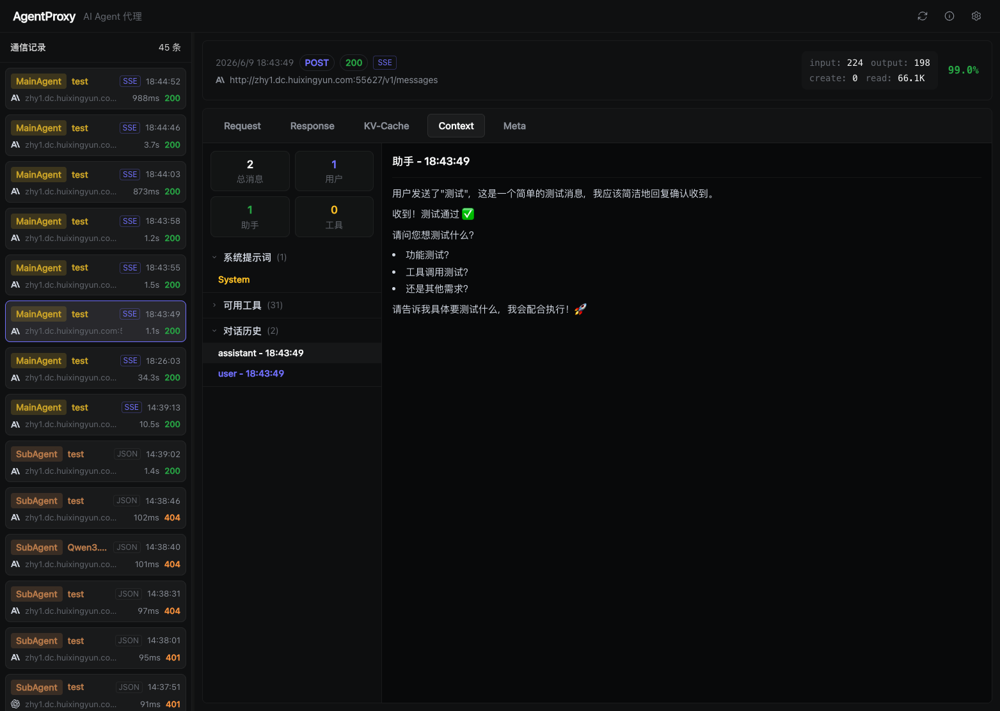

# Lucent

<p align="center">
  
</p>

<p align="center">
  <strong>AI Agent 透明代理</strong> — 穿透转发、全量记录、可视化 OpenAI / Claude API 通信
</p>

<p align="center">
  <a href="#快速开始">快速开始</a> · <a href="#cli-命令">CLI</a> · <a href="#功能特性">功能</a> · <a href="./DESIGN.md">设计文档</a>
</p>

---

## 设计思路

Lucent 是一个 **透明代理**，位于 AI 客户端和上游 API 之间，零侵入地穿透并记录所有通信：

```
Claude Code / Cursor / 其他客户端
            │
            ▼
    ┌───────────────┐
    │  Lucent   │  ← 透明代理 (端口 7048)
    │  穿透 · 记录   │
    └───────┬───────┘
            │ 穿透到上游
            ▼
   Anthropic / OpenAI API
```

**核心理念：** 客户端只需将 API Base URL 指向本地代理端口，请求直接穿透上游，同时获得完整的通信可视化能力，无需修改任何业务代码。

## 功能特性

- 📡 **透明代理** — 穿透转发 OpenAI / Claude API 请求与响应
- 📝 **全量记录** — Request、Response、KV-Cache-Text、Context 完整捕获
- 🏷️ **Agent 识别** — 自动区分主 Agent（MainAgent）和子 Agent（SubAgent）
- 🔧 **预设供应商** — 内置官方/社区预设，一键配置 Anthropic、OpenAI、DeepSeek 等
- 🎯 **多维筛选** — 按供应商、协议筛选通信记录
- ⚡ **SSE 就绪** — SSE 推送端点已搭建，支持流式数据通道
- 🌐 **Web UI** — 纯浏览器访问，无需安装桌面客户端
- 🎨 **深色 UI** — Linear 风格暗色设计，长时间使用不疲劳

## 快速开始

```bash
npm install
npm start
# 浏览器自动打开 http://localhost:7049
```

## 使用方法

### 第一步：配置供应商

打开 Web UI → 右上角 ⚙️ 设置 → 点击「新增供应商」：

1. **命名**：给供应商一个名字（如 `glm`、`deepseek`、`claude`），只允许字母、数字、下划线、短横线
2. **填 API Key**：供应商的认证密钥
3. **填端点 URL**：按供应商支持的协议填写对应地址（可只填一个）：
   - **Anthropic Messages**：如 `https://api.anthropic.com`（Claude 系列）
   - **OpenAI Chat**：如 `https://api.openai.com` 或 `https://api.deepseek.com`
   - **OpenAI Responses**：OpenAI 新 Responses API（如支持则填写）

> 💡 **提示**：未配置的协议端点访问时会返回 404。比如只填了 Anthropic Messages，访问 `/custom/glm/v1/chat/completions` 会报错。

### 第二步：接入下游客户端

启动 AI 客户端时，将 Base URL 指向本代理。**路径规则**：

| 供应商类型 | Base URL |
|-----------|---------|
| 预设供应商 | `http://127.0.0.1:7048/{供应商名}` |
| 自定义供应商 | `http://127.0.0.1:7048/custom/{供应商名}` |
| OpenAI 端点 | 上述规则末尾 + `/v1` |

```bash
# 预设供应商 GLM（无前缀）
export ANTHROPIC_BASE_URL=http://127.0.0.1:7048/glm

# 自定义供应商
export ANTHROPIC_BASE_URL=http://127.0.0.1:7048/custom/my-glm

# Codex / OpenAI 客户端（OpenAI Chat 协议，注意末尾 /v1）
export OPENAI_BASE_URL=http://127.0.0.1:7048/openai/v1
```

> 📌 **注意**：OpenAI Chat 协议的路径要加 `/v1`（因为标准路径是 `/v1/chat/completions`）。OpenAI Responses 同样。
> 应用内的 **使用说明** 弹窗会根据你配置的供应商自动生成可复制的 `export` 命令。

### 示例：GLM 同时支持两种协议

| 供应商类型 | Anthropic Messages | OpenAI Chat |
|-----------|--------------------|--------------|
| 预设 GLM | `http://127.0.0.1:7048/glm` | `http://127.0.0.1:7048/glm/v1` |
| 自定义 my-glm | `http://127.0.0.1:7048/custom/my-glm` | `http://127.0.0.1:7048/custom/my-glm/v1` |

## CLI 命令

```bash
lucent start            # 启动服务器
lucent stop             # 停止服务器
lucent status           # 查看状态
lucent logs             # 查看日志
lucent start -p 8080    # 指定端口启动
lucent start --open     # 启动后自动打开浏览器
```

## 界面说明

| 区域 | 功能 |
|------|------|
| 左侧日志列表 | 显示所有通信记录，支持按供应商/协议筛选，包含 Agent 类型、耗时、状态码 |
| 右侧详情面板 | 展示 Request / Response / KV-Cache / Context / Meta 五个 Tab |
| 顶部导航栏 | 应用标题 + 操作按钮（刷新、使用说明、配置） |

## 项目结构

```
lucent/
├── bin/              # CLI 入口
├── server/           # Express 服务器 + 代理 + SSE 推送
├── src/              # React 前端 (Vite + TypeScript + Ant Design)
│   ├── components/   # UI 组件 (日志列表、详情面板等)
│   ├── contexts/     # React Context 状态管理
│   ├── hooks/        # 自定义 Hooks (useLogs, useProxyStatus 等)
│   ├── utils/        # 工具函数 (API 请求、SSE 提取等)
│   └── types.ts      # 类型定义
├── dist/             # 构建输出
└── package.json
```

## 技术栈

| 层级 | 技术 |
|------|------|
| 前端 | React 19 · Ant Design 6 · Tailwind CSS 4 · Vite 6 |
| 后端 | Node.js 20+ · Express · WebSocket (ws) |
| 构建 | TypeScript · tsx · Vite |
| 测试 | Vitest |

## 开发

```bash
npm install     # 安装依赖
npm run dev     # 启动开发服务器 (HMR)
npm run build   # 构建生产版本
```

## 参考

本项目参考了 [cc-viewer](https://github.com/weiesky/cc-viewer) 的功能交互与页面排版设计。

## License

MIT
